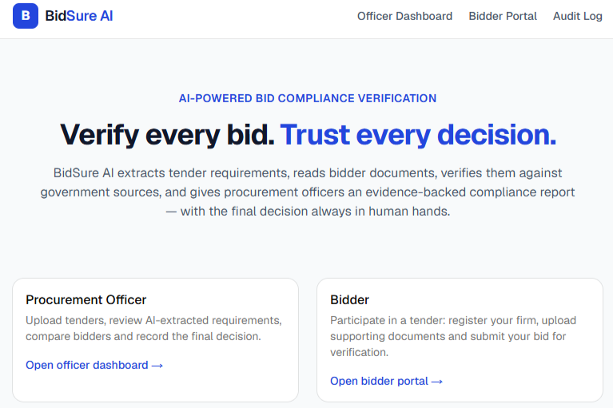
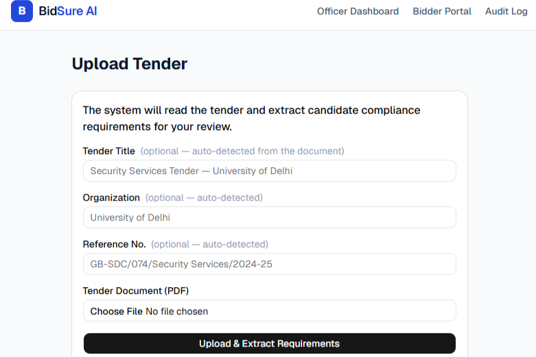
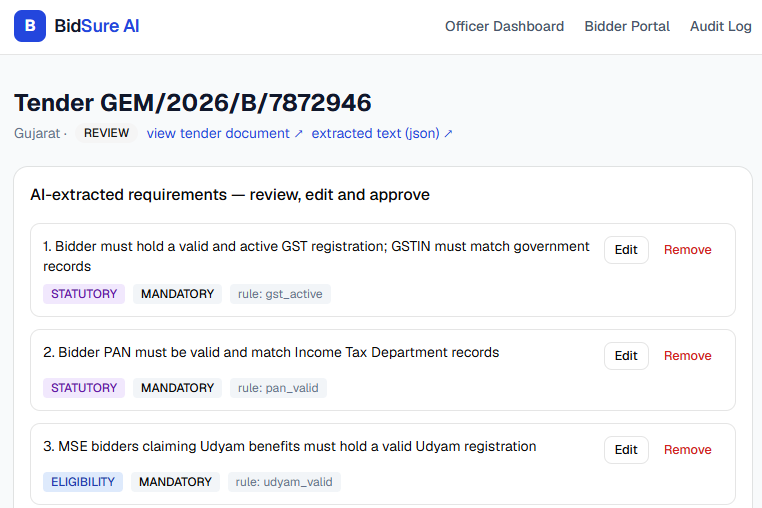
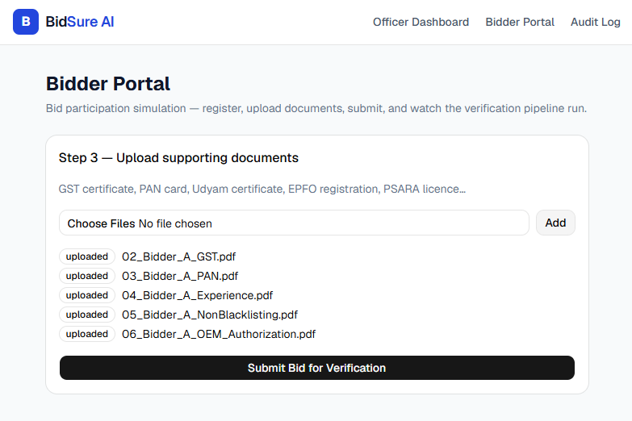
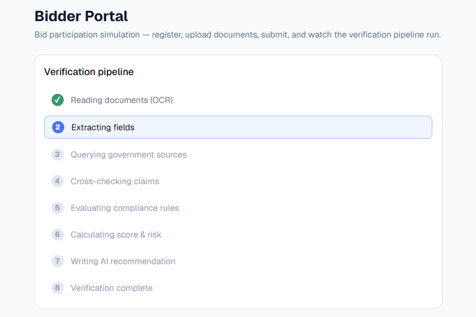
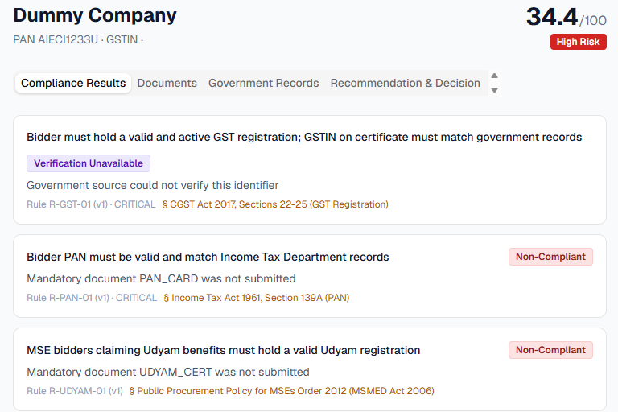
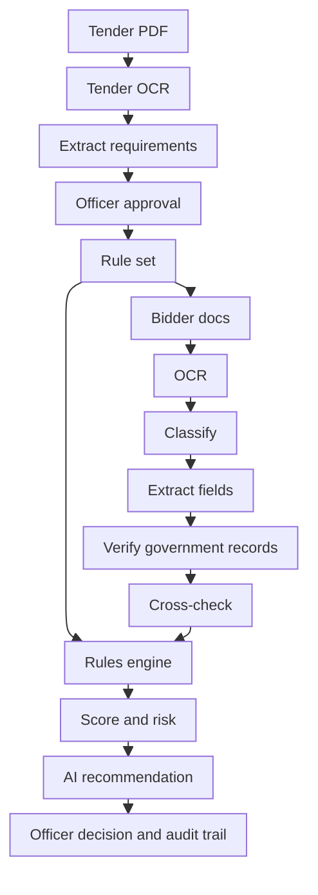

# BidSure AI

AI-powered bid compliance verification platform for GeM procurement.
Built for Smart India Hackathon 2026 — PS 26100 (AI-Powered Integrated Bid
Compliance Verification Platform for GeM Procurement, MoPNG / CPCL).

Procurement officers manually verify 10-15 documents per bidder against complex
tender requirements. BidSure AI reads the tender, extracts the compliance
requirements, verifies every bidder document against government records, and
gives the officer an evidence-backed scorecard — while the final decision
always stays with the officer.

## [Live demo](https://bidsure-ai.vercel.app) 🔗

| Product overview | Tender upload |
| --- | --- |
|  |  |

| Extracted requirements | Bidder document upload |
| --- | --- |
|  |  |

| Compliance check | Score and report |
| --- | --- |
|  |  |

## How it works



- **Requirement extraction** — reads the tender and builds an editable
  requirement checklist. Clauses with no built-in rule get an auto-drafted
  rule (with generated verification code) citing its legal basis from the
  govt rulebook (GeM GTC 4.0, GFR 2017, Minimum Wages Act, etc.). Officer
  approves before anything runs.
- **Document reader** — digital PDFs use their text layer; scanned documents
  go through stamp-aware OCR (red/blue ink suppression, Otsu binarization,
  best-of-N Tesseract passes) with structure-based repair of PAN/GSTIN
  misreads (O→0, I→1 fixed positionally).
- **Document classifier** — trained TF-IDF + Logistic Regression model
  (training script and metrics in the repo) identifies each uploaded document
  type with confidence; keyword rules as fallback.
- **Government verification** — adapter layer queries GST, PAN, Udyam, EPFO,
  MCA and debarment sources. The repo ships a mock replica of these APIs
  (API-Setu-style, seeded data); production swaps the base URL for the real
  authorized endpoints.
- **Rules engine** — deterministic YAML rules with weights and criticality.
  Five statuses: Compliant, Review Required, Non-Compliant, Not Applicable,
  Verification Unavailable. Missing mandatory evidence can never pass; an
  unavailable source never silently passes.
- **RAG evidence** — local MiniLM embeddings retrieve the closest document
  evidence for every flagged requirement (shown with similarity scores).
- **Audit trail** — every OCR run, source query, rule evaluation and officer
  action logged with actor, timestamp and document hash.

## Stack

FastAPI + SQLite (backend, port 8000) · FastAPI mock govt APIs (port 9000) ·
Next.js + Tailwind + shadcn/ui (frontend, port 3000) · Tesseract OCR ·
scikit-learn · sentence-transformers (all-MiniLM-L6-v2, self-hosted) ·
optional Gemini for requirement extraction / recommendation prose (offline
fallbacks built in — the demo runs with no network at all).

## Setup (macOS / Linux)

```bash
# python
python3 -m venv .venv
.venv/bin/pip install -r requirements.txt
brew install tesseract        # for scanned documents (apt install tesseract-ocr on linux)

# frontend
cd frontend && npm install && cd ..

# train the document classifier (weights are committed, rerun if you change the corpus)
.venv/bin/python scripts/train_classifier.py
```

## Setup (Windows)

```powershell
# python (3.11+)
python -m venv .venv
.venv\Scripts\pip install -r requirements.txt

# tesseract (for scanned documents) - installer adds it to PATH; restart the terminal after
winget install UB-Mannheim.TesseractOCR

# frontend
cd frontend; npm install; cd ..

# train the document classifier (weights are committed, rerun only if you change the corpus)
.venv\Scripts\python scripts\train_classifier.py
```

Run on Windows (three terminals, or use `Start-Process`):

```powershell
# terminal 1 - govt api replica
cd govt-api; ..\.venv\Scripts\python -m uvicorn main:app --port 9000

# terminal 2 - backend (set the optional Gemini key first if you have one)
$env:GEMINI_API_KEY = "your-key"; $env:GEMINI_FEATURES = "recommend"
cd backend; ..\.venv\Scripts\python -m uvicorn app.main:app --port 8000

# terminal 3 - frontend
cd frontend; npm run dev
```

Seed demo data (any terminal, services running):

```powershell
.venv\Scripts\python scripts\seed.py --checkpoint evaluated
```

## Run

```bash
bash scripts/start_all.sh                            # all three services
.venv/bin/python scripts/seed.py --checkpoint evaluated   # demo data reset
```

- Frontend: http://127.0.0.1:3000
- Backend API: http://127.0.0.1:8000/docs
- Govt API replica: http://127.0.0.1:9000/docs

Seed checkpoints: `clean` | `tender` | `evaluated` (bidders A and B processed,
C left for a live run) | `full`.

## Demo data

`demo-assets/` contains a real 38-page University of Delhi security-services
tender, the GeM GTC 4.0 reference document, and generated sample documents for
three fictional bidders:

| Bidder | Documents | Outcome |
|--------|-----------|---------|
| Shakti Facility Services | all valid, matches govt records | ~100 / Low risk |
| Nirmal Security Solutions | GSTIN typo on certificate, expired EPFO | Review / Medium |
| Apex Guarding Co | missing PSARA licence, debarred | Non-compliant / High |

`scanned_gst_stamped.png` is a scanned certificate with a stamp and signature
across the text — for demonstrating the OCR pipeline.

All identifiers and records are synthetic.

## Tests

```bash
.venv/bin/python -m pytest backend/tests govt-api/tests
```

Covers the rules engine (including the demo bidder matrix and the
missing-mandatory / source-unavailable guardrails), cross-checking, scoring,
dynamic rule drafting and generated-code parity, OCR repair, the ML layer,
identifier validation, and an end-to-end API flow against a live govt-replica
process.
